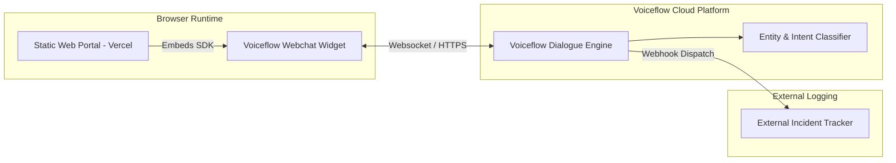

# IT Service Desk Pre-Triage Portal (Interactive Prototype)

A pre-triage intake portal designed to capture technical diagnostic data from users before incidents reach human IT service engineers.

- **Live Prototype:** [https://triage-portal-dun.vercel.app](https://triage-portal-dun.vercel.app)
- **Repository:** [https://github.com/Krishnanegi074/it-service-desk-portal](https://github.com/Krishnanegi074/it-service-desk-portal)

---

## 1. System Status & Implementation Breakdown

To maintain engineering transparency, this project separates client code from external conversational runtimes:

### Currently Implemented (Native to this Repository)
- **Web Portal Frontend:** Responsive single-page interface built with semantic HTML5 and vanilla CSS.
- **Embedded Conversational Widget:** Integration layer invoking the official Voiceflow Webchat Runtime SDK (`bundle.mjs`).
- **Client Deployment:** Continuous deployment configured via Vercel edge infrastructure.

### Handled Externally (Hosted via Voiceflow Cloud)
- **Conversational State Machine:** Dialogue flows, entity extraction (OS, network location, error strings), and slot-filling logic are configured and hosted inside Voiceflow's hosted canvas.
- **Triage Synthesis:** Compilation of conversation data into an in-chat `IT Triage Summary` card.
- **Dispatch Webhook:** External trigger transmitting the completed session data to an external incident log.

### Planned Functionality (Next.js Full-Stack Migration)
- Migration of conversational logic and state machines into version-controlled TypeScript code.
- Relational persistence with PostgreSQL (Neon/Supabase).
- Deterministic ITIL priority matrix (Impact × Urgency calculation).
- Authenticated Engineer Operations Dashboard.
- Direct API integration with Jira Service Management.

---

## 2. Current Architecture



---

## 3. Known & Security Limitations

- **Prototype Exposure:** The Voiceflow Project ID is embedded in client-side HTML, which is standard for public webchat widgets but subjects free-tier monthly credits to exhaustion if subjected to high traffic.
- **No Native Authentication:** The current static intake is unauthenticated; any visitor can initiate a discovery session.
- **Absence of Server-Side Redaction:** Sensitive inputs (e.g., credentials or tokens entered by mistake) are not currently scrubbed by a custom proxy before reaching the external runtime.
- **Read-Only Status:** The header badge indicates `Interactive Prototype` and is not connected to a live infrastructure status provider.

---

## 4. Local Development & Setup

This prototype requires zero build tools or package managers to run locally.

1. **Clone the repository:**
   ```bash
   git clone https://github.com/Krishnanegi074/it-service-desk-portal.git
   cd it-service-desk-portal
   ```

2. **Serve locally:**
   Using Python 3:
   ```bash
   python3 -m http.server 3000
   ```

3. **Open in browser:**
   Navigate to `http://localhost:3000`.
